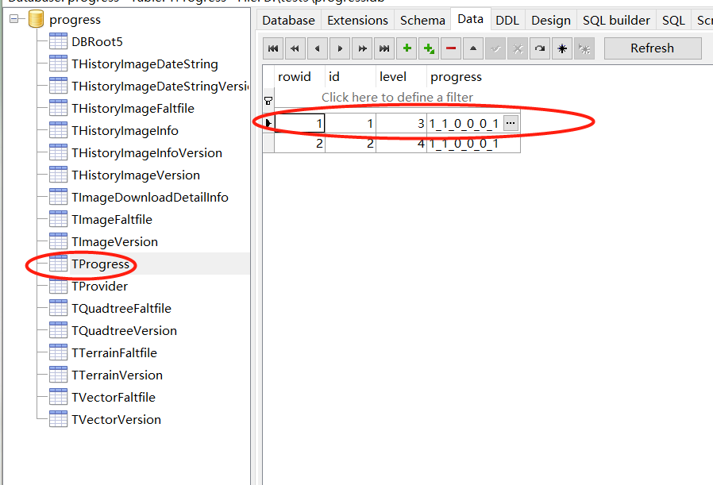

# Tile Thief 网络地图下载
基于python和c++混合开发，业务逻辑层采用python语言，google earth数据解析和下载模块采用c++语言。客户端通过websocket请求调用启动下载
python部分开发环境vscode，c++部分 visual c++ 2013

## 1.安装

1.1安装 python 3.8.x 版本, 并配置python环境变量
https://www.runoob.com/python/python-install.html

1.2 运行库安装

先安装gdal和rasterio开发库，离线安装whl文件在install目录也可以从这里下载：https://www.lfd.uci.edu/~gohlke/pythonlibs/#rasterio
碰到缺什么，直接pip install 就可以了（国内网络建议使用清华或豆瓣pypi地址）
``` bash
pip install ****

```

### 2  使用说明

服务端启动 
```python .\src\server.py``` ，默认监听6789端口

客户端使用websocket client 打开地址 ``` ws://localhost:6789/user ``` 连接成功后可以send请求到服务端

action说明如下
#### 2.1 get_google_history 

查询某一层级google earth可供下载的历史影像列表

参数：

- **geometry** : geojson格式多边形，代表下载区域范围

- **zoom** : 0~22 数值,代表不同比例尺等级

example:
```
{"action":"get_google_history","params":{"geometry":{
      "type": "Feature",
      "properties": {},
      "geometry": {
        "type": "Polygon",
        "coordinates": [
          [
            [
              106.4753723144531250,
               29.5243835449218750
            ],
            [
              106.4753723144531250,
              29.5243835449218750
            ],
            [
              106.5769958496093750,
               29.6150207519531250
            ],
            [
              106.5769958496093750,
               29.5243835449218750
            ],
            [
              106.4753723144531250,
               29.5243835449218750
            ]
          ]
        ]
      }
    },"zoom":9}}
``` 

### 2.2 get_data_count 
给定下载范围和下载层级获取每个层级包含的瓦片数量，目前百度地图只支持矩形查询；根据瓦片数量可以大致估算出需要下载的字节大小，每个缩放等级对应的比例尺信息请参考水经注软件
- **type** : 类型：“imagery”,"vector"
- **min_zoom** : 最小缩放层级 0~22

- **max_zoom** : 最大缩放层级 0~22

- **geometry** ：geojson格式范围

- **map_type** ："google_map_sat","amap_sat","tianditu_sat","bing_sat","tencent_sat"","baidu_sat","google_earth_sat","google_earth_dem" 

example:
```
{
  "action":"get_data_count",
  "params":{"geometry":{
      "type": "Feature",
      "properties": {},
      "geometry": {
        "type": "Polygon",
        "coordinates": [
          [
            [
              106.4753723144531250, 
              29.5243835449218750
            ],
            [
              106.4753723144531250,
              29.5243835449218750
            ],
            [
              106.5769958496093750, 
              29.6150207519531250
            ],
            [
              106.5769958496093750, 
              29.5243835449218750
            ],
            [
              106.4753723144531250, 
              29.5243835449218750
            ]
          ]
        ]
      }
    },"min_zoom":3,"max_zoom":16,"type":"imagery","map_type":"google_map_sat"}}
```


获取矢量数据大小example：

```
{
  "action":"get_data_count",
  "params":
    {
        "type":"vector",
        "name":"Angola",
        "format":"pbf"
    }
}
```
矢量数据大小按照字节数返回:

```
{"vector_size": 54197391}
```

### 2.3 start_task

**下载完成后记得调用cancle_task杀掉下载进程**
#### 2.3.1 栅格数据下载

- **type:** "imagery"
- **min_zoom:** 最小缩放层级 0~22
- **max_zoom:** 最大缩放层级 0~22
- **geometry:** geojson格式下载范围
- **map_type:** 地图类型
- **output_dir:** 输出文件夹目录
- **process_count:** 并发数


瓦片下载example
```
{
  "action":"start_task",
  
  "params":{
    "type":"imagery",
    "geometry":{
      "type": "Feature",
      "properties": {},
      "geometry": {
        "type": "Polygon",
        "coordinates": [
          [
            [
              106.4753723144531250, 
              29.5243835449218750
            ],
            [
              106.4753723144531250,
              29.5243835449218750
            ],
            [
              106.5769958496093750, 
              29.6150207519531250
            ],
            [
              106.5769958496093750, 
              29.5243835449218750
            ],
            [
              106.4753723144531250, 
              29.5243835449218750
            ]
          ]
        ]
      }
    },"min_zoom":3,"max_zoom":16,"map_type":"google_map_sat",
    "process_count":3,
    "output_dir":"/Users/zuojingwei/Dev/tile_thief/tiles/"
    }
}
```

#### 2.3.2 矢量数据下载
- **type** "vector"
- **name:** 下载区域，例如"Angola","Japan"等
- **format:** 下载格式，pbf 、shp、osm
- **output_dir:** 输出路径

example:
```
{
  "action":"start_task",
  "params":
    {
        "type":"vector",
        "name":"Angola",
        "format":"pbf",
        "output_dir":"/Users/zuojingwei/Dev/tile_thief/tiles/"
    }
}
```
### 2.4 cancle_task 

中止下载，下次再启动时下载程序会检查文件是否完整，已经下载过的区域不会重复下载

example

```
{
  "action":"cancle_task","pid":12744
}
```
### 2.5 进度条更新
客户端定期调用接口，根据pid获取任务进度。

瓦片下载任务返回瓦片下载个数，google earth下载任务返回已完成区块个数，矢量数据返回已完成字节数。
请求示例:
**action:** 字符串 "get_progress"
```
{
  "action":"get_progress",
  "pid": [123,456]
}
```
返回 example：
如果"progress_value"为负值代表异常
```
{
  123:90,456:100
}
```
### 2.6 获取错误日志
客户端定期调用接口，根据pid获取错误日志。

可选择传入数量字段，用于倒序获取错误日志列表。
请求示例:
**action:** 字符串 "get_error_logs"
```
{
  "action":"get_error_logs",
  "pid": [123,456]
}
```
返回 example：
```
{
  123:[],456:[]
}
```

## 3 代码结构
```
src 代码目录
---data
-------vector_list.json OSM下载源地址列表
-------vector_map.json OSM下载源映射表
---template  websocket测试js客户端. **debprecated**
---utils 下载库文件
--------dem google earth数据下载库，gehelper_py.pyd为python接口
-----------libge vs2013工程版本google earth 单线程下载源码，c++实现
--------bounds2tiles.py 根据矩形范围，计算包含的墨卡托投影瓦片
--------custom_request.py request封装函数，方便捕获异常
--------download_tiles.py 瓦片下载函数
--------downloader.py 分块下载逻辑对象
--------geojson2tiles.py 根据多边形范围返回包含的墨卡托瓦片
--------map_baidu.py 百度地图下载逻辑
--------map_bing.py 必应地图下载逻辑
--------map_tencent.py 腾讯地图下载逻辑
--------metadata.json mbtiles属性信息模板
--------tile_util.py 瓦片行列号计算函数
--------tiles2mbtiles.py xyz格式瓦片文件夹转换为sqlite格式mbtiles
--------translate.py gdal转换样例代码
--------util.py mbtiles操作函数库
---command.py **deprecated**
---download.py 下载函数API入口
---server.py  websocket服务入口
```
## 4 测试方法

### 4.1 软件启动
命令行进入到tile_thief目录
```
python .\src\server.py 
```
### 4.2 websocket客户端安装启动

打开chrome webstore 搜索websockets,如下图  安装 webSocketTestClient


然后打开插件 

打开 ws://localhost:6789/user
输入 Request命令即可执行测试任务


### 5 Google Earth 结果统计和进度查看

#### 5.1 进度查看

进度记录表：字段id progress
progress字段取值说明：1_0_0_0_0         总数_成功个数_获取Qtree失败个数_查询版本不存在个数_下载图像失败_已处理个数


#### 5.2 瓦片统计结果查看

瓦片详细信息表： 字段id、zxy、bbox、download_status
zxy ： 瓦片编号
bbox: 瓦片坐标范围
download_status : 瓦片下载状态，取值包括 ok、get_qtree_failed、get_version_failed、already_downloaded

